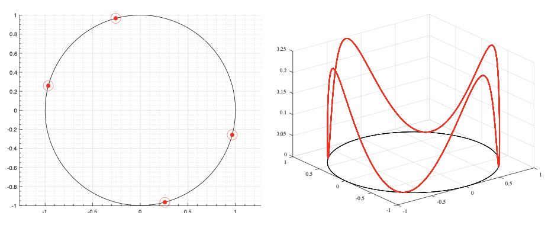

<!-- Title -->
<h1 align="center">
  Optimal actuator design via Brunovsky's normal form
</h1>

<tt>Matlab</tt> (<tt>CasADi-IPOPT</tt>) and <tt>Python</tt> codes for the paper 
[*Optimal actuator design via Brunovsky's normal form*](https://arxiv.org/abs/2108.05629) by Borjan Geshkovski and Enrique Zuazua. (Accepted in IEEE Transactions of Automatic Control.)

<p align="center">
  
</p>

## Abstract 

*In this paper, by using the Brunovsky normal form, we provide a reformulation of the problem consisting in finding the actuator design which minimizes the controllability cost for finite-dimensional linear systems with scalar controls. Such systems may be seen as spatially discretized linear partial differential equations with lumped controls. The change of coordinates induced by Brunovsky's normal form allows us to remove the restriction of having to work with diagonalizable system dynamics, and does not entail a randomization procedure as done in past literature on diffusion equations or waves. Instead, the optimization problem reduces to a minimization of the norm of the inverse of a change of basis matrix, and allows for an easy deduction of existence of solutions, and for a clearer picture of some of the problem's intrinsic symmetries. Numerical experiments help to visualize these artifacts, indicate further open problems, and also show a possible obstruction of using gradient-based algorithms - this is alleviated by using an evolutionary algorithm.*

## Citing

```
@article{geshkovski2021optimal,
  title={Optimal actuator design via Brunovsky's normal form},
  author={Geshkovski, Borjan and Zuazua, Enrique},
  journal={arXiv preprint arXiv:2108.05629},
  year={2021}
}
```

<p align="center">
  
</p>
